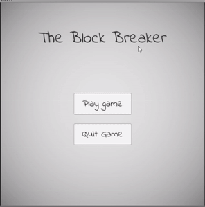

# Block-Breaking-Casual-Game
A simple casual game made with Unity. You flick a colored ball around the play area, but you have to flick it in the direction of cubes of the same color as the ball to gain score.

This is an endless game where you can flick the ball and destroy blocks to gain as many score, score is gain by destroying blocks of the same color as the ball every round. The amount of blocks increases as the round continues. Every round is 60 seconds, should the blocks of the same color as the ball hasnt been destroyed then its game over.
